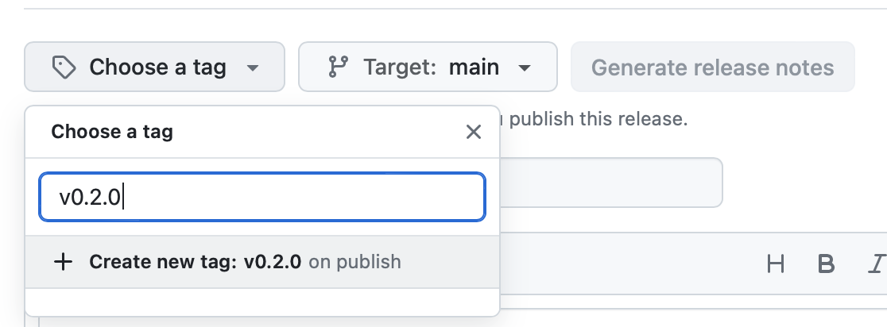
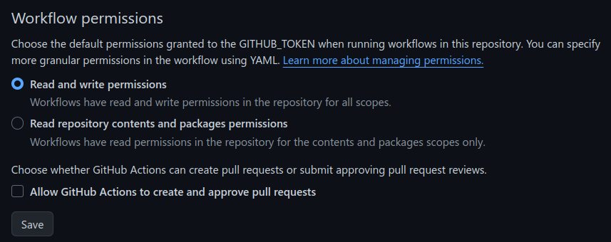

# Troubleshooting

There are a few issues that you might run into when setting up the companion application. We collected them here, along with hints on how to resolve them. If you run into another problem that is not listed here, we welcome you [to create an issue in the respective repository](https://github.com/eclipse-sdv-blueprints/companion-application/issues).

## General

### There was an error with the tag while creating your Release

For instance, a tag name cannot be blank, a tag name is not well-formed, and published releases must have a valid tag.

During the process of creating a release in GitHub, make sure to select or create a tag, e.g., in the "choose tag" drop-down.



### Eclipse Velocitas multiarch release workflow failing

If any of the workflow (CI, Multiarch, Release) fail, one reason could be that the workflow is not able to push to the container registry linked to the repository due to missing permissions in Github.

You can fix this in the repository settings under
`Code and automation` -> `General` -> `Workflow permissions`

by selecting the option `Read and write permission`.



Another problem with the execution of the workflows could be that they are disabled for the repository. One can allow the execution of workflows in the repository through

`Settings` > `Code and automation` > `Action` > `General` > `Actions Permissions`

Make sure that the Actions permission is "Allow all actions and reusable workflows"

Afterward, you can try to re-run the workflow in the workflow view.

### You get a 401 Unauthorized error when trying to download the container image of your application

If the GitHub packages in which you stored the container image are private, Eclipse Kanto needs a valid access token to download the container image. Otherwise, it will just get the response `401 Unauthorized` from GitHub.

You can create a personal access token in the `Settings` of your GitHub account. Go to

`Developer Settings` > `Personal access token` > `Tokens (classic)`

and `generate a new token` that at least has the `read:packages` permission. Copy the generated token to a secure location or to Eclipse Kanto
because GitHub will not show it again.

You can now configure Eclipse Kanto in Eclipse Leda to use the token by executing:

```bash
sdv-kanto-ctl add-registry -h <registryhostname> -u <your_username> -p <your_password>
```

In the case of GitHub, the `<registryhostname>` is `ghcr.io`
, `<your_username>` is your GitHub handle, and `<your_password>` is the generated token.

See [the Eclipse Leda documentation on Container Registries](https://eclipse-leda.github.io/leda/docs/device-provisioning/container-management/container-registries/) for more details.

Alternatively, you could change the visibility of your repository to `public` if you are ok with everyone being able to see and download your application. You can change the visibility of the repository in the `Danger Zone` at the bottom of the `Settings` tab of the repository.

## DevContainer & Docker

### Project does not re-open in DevContainer

This could, for example, come with an error message that the Docker daemon is not running.

One reason for this message could be that the regular user on your development computer does not have access rights to interact with the Docker daemon. To change your access rights, follow the Docker documentation on how to [Manage Docker as a non-root user](https://docs.docker.com/engine/install/linux-postinstall/#manage-docker-as-a-non-root-user).

As an alternative, you can close and re-run VSCode as root user with this command in the terminal:

```bash
sudo code --user-data-dir="~/.vscode-root"
```

### DevContainer fails to open
  
If the DevContainer does not start at all, make sure that you installed Docker correctly by checking the output of:

```bash
docker --version
docker run hello-world
```

If the problems persist, you might have a misconfiguration of your Docker installation.

Another issue could be that you are in the wrong Docker context. In order to debug the list, list the contexts with:

```bash
docker context list
```

If you see multiple contexts, try switching to the default or another one:

```bash
docker context use default
```

Once you have switched to a different context, try reopening in DevContainer.

If none of the above steps helped, you can try purge and re-install the whole Docker installation:

In Ubuntu, this is possible with:

```bash
sudo apt-get purge docker-ce docker-ce-cli containerd.io
sudo rm -rf /etc/docker/ /var/lib/docker/
```

To avoid conflicts during the reinstallation, remove Docker repositories:

```bash
sudo rm /etc/apt/sources.list.d/docker.list
sudo apt-get update
```

You can then follow the referenced documentation to either install the [Docker Engine](https://docs.docker.com/engine/install/#desktop) or a Docker distribution like [Docker Desktop](https://www.docker.com) or [Rancher Desktop](https://rancherdesktop.io).
